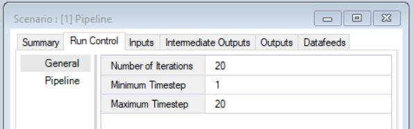
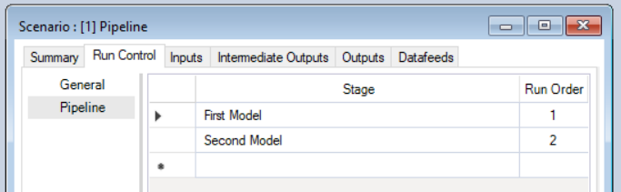
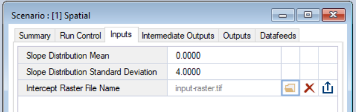
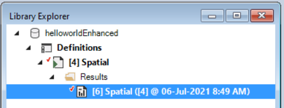
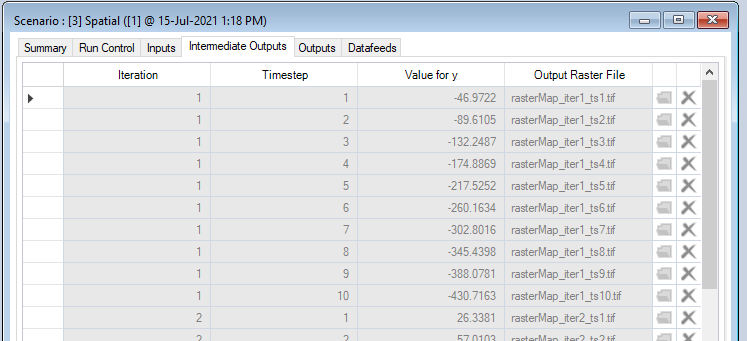
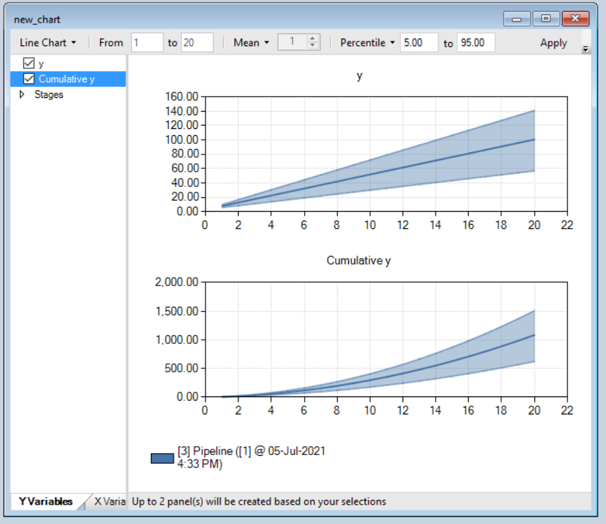
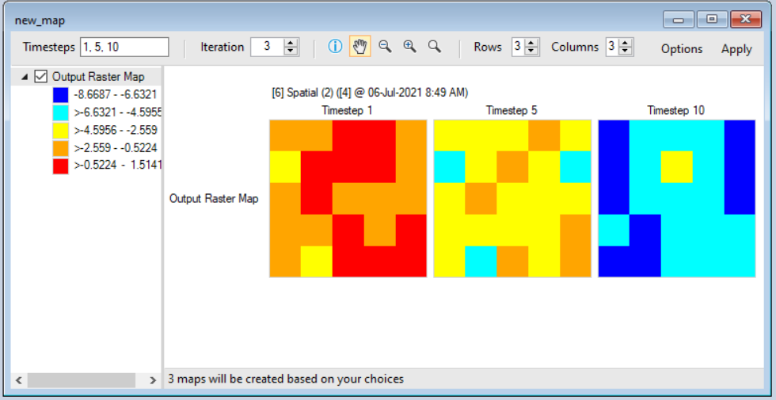

# Getting started with **helloworldEnhanced**

## Quickstart Tutorial

1. Download and install SyncroSim 2.3.2 or later from <a href="https://syncrosim.com/download/" target="_blank">https://syncrosim.com/download/</a>.

2. Install the *helloworldEnhanced* package in the SyncroSim user interface by selecting **File \| Packages \| Install...**
 
 
3. If you need to update package versions, in SyncroSim go to **File \| Packages \| Update...**
 
 
4. Create a new *helloworldEnhanced* Library
  * In SyncroSim, select **File \| New Library...**
  * Select the *helloworldEnhanced* base package and choose the *Empty Library* template.
  * Enter a **Filename** (ok to keep the default) and a **Folder** for your new Library, then click **OK**.
 
 
3. First, check your executable location by clicking on the **helloworldEnhanced** Library in the <a href="https://docs.syncrosim.com/how_to_guides/library_overview.html" target="_blank">Library Explorer</a>, and then selecting **Library Properties** from the **File** menu. Select the **R Configuration** tab to check and/or set the location of your R program executable.
 
 
4. To set the number of time steps and iterations, right-click on the auto-generated empty **New Scenario** in the <a href="https://docs.syncrosim.com/how_to_guides/library_overview.html" target="_blank">Library Explorer</a> and select **Properties**. Then select the **Run Control - General** tab. Fill in the **Number of Iterations**, the **Minimum Timestep**, and the **Maximum Timestep**.
 

 
 
5. To use a Pipeline in your scenario, still within **Properties**, navigate to the **Run Control - Pipeline** tab. Set the model named **First Model** to run first, and the model named **Second Model** to run second.
 

 
 
4. To edit the Scenario inputs, still within **Properties**, navigate to the **Inputs** tab and enter values for your **mMean**, **mSD**, and **Intercept Raster File Name** model inputs in the grid.
 

 
 
5. To run the Scenario, right-click on this **New Scenario** again in the <a href="https://docs.syncrosim.com/how_to_guides/library_overview.html" target="_blank">Library Explorer</a> and select **Run**.
 
 
6. Once the run is complete, return to the <a href="https://docs.syncrosim.com/how_to_guides/library_overview.html" target="_blank">Library Explorer</a>. Expand the node beside the **New Scenario** to reveal a **Results** folder containing your results, then expand the node beside the **Results** folder to show the newly generated date/time stamped *Results Scenario*. Each *Results Scenario* contains a read-only snapshot copy of all your inputs at the time of your run, along with values for your model generated outputs.
 

 
 
7. Right-click on this *Results Scenario* and select **Properties** to view the details of this *Results Scenario*; you will find your calculated outputs under the **Intermediate Outputs** and **Outputs** tabs.  
 

 
 
8. To view charts of the results from each model in the pipeline, select the **Create a new chart** button in the **Results Viewer**. Select both **y** and/ **Cumulative y** from the left-hand column. Click **Apply**
 

 
 
9. To view maps of the results from the spatial model, click on the **Maps** tab in the **Results Viewer**, and click **Create a new map**. Select **Output Raster Map** from the left-hand side. Click **Apply** to view the map of the last timestep for the first iteration. You can change the **Timesteps** or **Iteration** by modifying the values in the top toolbar.
 

 
 
For the complete tutorial on how to create the *helloworldEnhanced* Package, see the <a href="https://docs.syncrosim.com/how_to_guides/package_enhance_overview.html" target="_blank">enhancing a package</a> tutorial in the <a href="https://docs.syncrosim.com/" target="_blank">SyncroSim documentation</a>.
