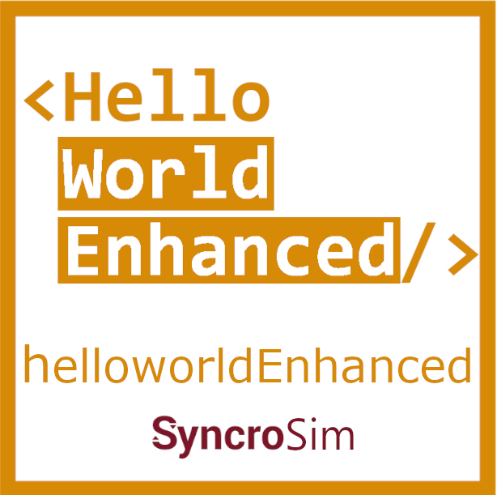

# **Hello World Enhanced** SyncroSim Package

    <a href="https://github.com/ApexRMS/helloworldEnhanced">
 
## An enhanced example of a [SyncroSim](https://syncrosim.com/) package
### The *Hello World Enhanced* package is intended as an example of how to enhance a simple [SyncroSim](https://syncrosim.com/) package. Instructions on how to build off the original [*Hello World* package](https://apexrms.github.io/helloworld/) to create the *Hello World Enhanced* package are posted in the SyncroSim documentation on [enhancing a package](https://docs.syncrosim.com/how_to_guides/package_enhance_overview.html).

The *Hello World Enhanced* package was designed as an example of how to add more complex features to a [SyncroSim](https://syncrosim.com/) package. The package is featured in the [enhancing a package](https://docs.syncrosim.com/how_to_guides/package_enhance_overview.html) tutorial, which covers the steps needed to [add timesteps](https://docs.syncrosim.com/how_to_guides/package_create_timesteps.html), [display charts](https://docs.syncrosim.com/how_to_guides/package_create_charts.html), [represent uncertainty](https://docs.syncrosim.com/how_to_guides/package_create_iterations.html), [link models](https://docs.syncrosim.com/how_to_guides/package_create_pipelines.html), and [integrate spatial data](https://docs.syncrosim.com/how_to_guides/package_create_spatial.html) in your package.

## Requirements

This package requires SyncroSim [2.3.2](https://syncrosim.com/download/).
 
 
## How to Install

Open SyncroSim and select **File -> Packages… -> Install…**, then select the **Hello World Enhanced** package and click OK.

Alternatively, download [the latest release from Github](https://github.com/ApexRMS/helloworldEnhanced/releases/). Open SyncroSim and navigate to packages, then install from file.
 
 
## Getting Started

For more information on **Hello World Enhanced**, including a Quickstart Tutorial, see the [Getting Started](https://apexrms.github.io/helloworldEnhanced/getting_started.html) page.
 
 
## Links

Access tutorial at
[https://docs.syncrosim.com/how_to_guides/package_enhance_overview.html](https://docs.syncrosim.com/how_to_guides/package_enhance_overview.html)
 
Browse source code at
[http://github.com/ApexRMS/helloworldEnhanced/](http://github.com/ApexRMS/helloworldEnhanced/)
 
Report a bug at
[http://github.com/ApexRMS/helloworldEnhanced/issues](http://github.com/ApexRMS/helloworldEnhanced/issues)
 
 
## Developers

Katie Birchard (Author, maintainer)
 
Leonardo Frid (Author) 
 
Colin Daniel (Author)
